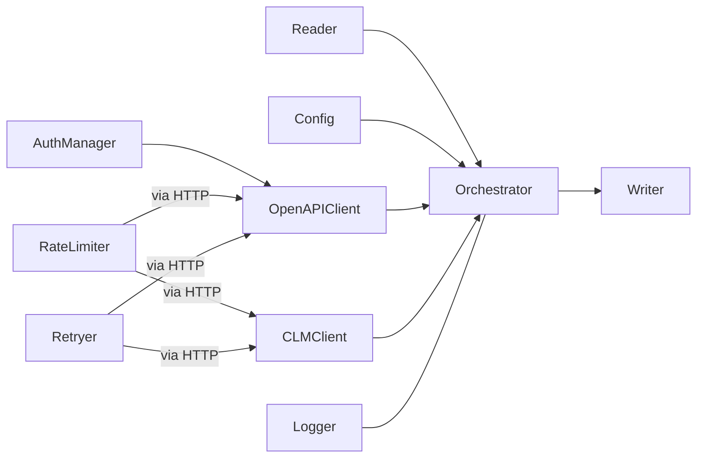

# 从合同编码批量拉取飞书协同群聊ID — 技术方案

版本：v0.1  
状态：可实施

## 1. 目标与范围

- 依据合同编码（contract_number），经三段链路查询获得协同群聊 openChatId：
  1) 合同搜索 → contract_id
  2) 合同详情（contractAndTask）→ cooperation_id
  3) 协同详情（cooperation/info）→ openChatId
- 输入为 TXT 清单（每行一个 contract_number），输出为 Excel：contract_number、contract_id、cooperation_id、openChatId、status、error_message（以及可选 error_code）。
- 满足 QPM 限流、指数退避重试、结构化日志；单合同内串行，合同间并发度默认 1（可配置）。

## 2. 架构概览

- 组件划分：
  - Reader：读取与规范化 TXT 合同编码列表。
  - Config：读取 config.yaml，提供运行期配置。
  - AuthManager：获取并缓存 Tenant Access Token（OpenAPI）。
  - OpenAPIClient：调用合同搜索接口（Bearer Token）。
  - CLMClient：调用 CLM 内部接口（基于 session Cookie）。
  - RateLimiter：全局与接口级令牌桶限流。
  - Retryer：指数退避 + 抖动的重试封装。
  - Orchestrator：编排“单合同三步串行”的处理流，汇总结果。
  - Writer：输出 Excel（openpyxl/xlsxwriter）。
  - Logger：结构化日志（JSON 行或文本）。

- 数据流：
  TXT → Reader → [for each contract_number] → OpenAPIClient.search → contract_id → CLMClient.contractAndTask → cooperation_id → CLMClient.cooperation/info → openChatId → Writer 写入 Excel。

### 2.1 项目目录结构

```text
project-root/
 ├─ config.yaml
 ├─ config.example.yaml
 ├─ input/
 │  └─ contracts.txt
 ├─ output/
 │  └─ contract_openChatId.xlsx
 ├─ logs/
 ├─ src/
 │  ├─ __init__.py
 │  ├─ models.py                 # 数据模型与状态枚举（ResultRow、Status 等）
 │  ├─ utils.py                  # 通用工具（时间、JSON 提取等，可选）
 │  ├─ config.py                 # 加载与校验 config.yaml
 │  ├─ auth.py                   # AuthManager：tenant_access_token 获取与缓存
 │  ├─ orchestrator.py           # 编排：单合同三步串行、写入结果
 │  ├─ io/
 │  │  ├─ __init__.py
 │  │  ├─ reader.py              # 读取 TXT 到 contract_numbers 列表
 │  │  └─ writer.py              # 写入 Excel（列顺序与需求一致）
 │  ├─ http/
 │  │  ├─ __init__.py
 │  │  ├─ client.py              # 统一 HTTP 客户端、错误映射、超时
 |  │  ├─ retry.py               # 指数退避 + 抖动策略
 │  │  └─ rate_limiter.py        # 令牌桶限流（global/search/contract_info/cooperation_info）
 │  ├─ openapi/
 │  │  ├─ __init__.py
 │  │  └─ contract_client.py     # 合同搜索（contract_number→contract_id）
 │  └─ clm/
 │     ├─ __init__.py
 │     └─ clm_client.py          # 合同详情/协同详情（→cooperation_id/openChatId）
 ├─ main.py                      # 程序入口（--config config.yaml）
 ├─ README.md
 ├─ 需求文档.md
 └─ 技术方案.md
```

说明：所有模块命名与术语保持一致，统一使用 `contract_number` 与 `openChatId`；配置来源为 `config.yaml`。

### 2.2 模块职责说明

- **main.py**：解析参数 → 加载配置 → 初始化核心组件（RateLimiter/Retryer/AuthManager/Clients）→ 调用 Orchestrator。
- **src/config.py**：读取与校验 `config.yaml`，提供强类型配置对象；默认值与边界校验（QPM、重试、路径存在性）。
- **src/models.py**：结果行 `ResultRow`、状态枚举 `Status`、错误对象；保证输出列与需求一致。
- **src/auth.py**（AuthManager）：获取与缓存 `tenant_access_token`，在过期前刷新；对外提供 `get_tenant_access_token()`。
- **src/http/client.py**：统一请求封装（超时、Headers、JSON 序列化），错误归一化（HTTP→业务错误码）；可插桩日志。
- **src/http/retry.py**：指数退避 + 抖动，实现可重试条件（429/5xx/超时）。
- **src/http/rate_limiter.py**：令牌桶实现，支持 global 与接口级限流；请求前阻塞获取令牌。
- **src/openapi/contract_client.py**：
  - `search_contract_id(contract_number) -> (contract_id, retry_count)`；解析路径 `$.data.items[0].contract_id`；空集返回未找到。
- **src/clm/clm_client.py**：
  - `get_cooperation_id(contract_id) -> (cooperation_id, retry_count)`；路径 `$.data.contract.contractInfo.cooperationId`。
  - `get_open_chat_id(cooperation_id) -> (openChatId, retry_count)`；路径 `$.data.openChatId`。
- **src/io/reader.py**：读取 TXT（忽略空行与#注释），trim 与去重，保持输入顺序。
- **src/io/writer.py**：按列顺序写入 Excel；支持批量缓冲写、断点续写（可选）。
- **src/orchestrator.py**：单合同串行三步，跨合同按 `concurrency` 控制并发；汇总 `status/error_message/retry_total/duration_ms` 并写出。
- **src/utils.py**：通用函数（时间/格式化/JSONPath 提取等，可选）。

### 2.3 组件交互图（简化）



### 2.4 详细时序图

```mermaid
sequenceDiagram
  autonumber
  participant Main as main.py
  participant Orchestrator
  participant Reader
  participant Auth as AuthManager
  participant OpenAPI as OpenAPIClient
  participant CLM as CLMClient
  participant RL as RateLimiter
  participant RT as Retryer
  participant Writer
  participant Logger

  Main->>Orchestrator: 加载 config.yaml，初始化 RL/RT/Auth/Clients
  Orchestrator->>Reader: 读取 TXT（contracts.txt）
  Reader-->>Orchestrator: contract_numbers[]

  loop 遍历每个 contract_number（并发=1）
    Orchestrator->>Logger: SEARCH 开始
    Orchestrator->>RL: 获取令牌（global, contract_search）
    RL-->>Orchestrator: 许可
    Orchestrator->>Auth: 获取 tenant_access_token
    Auth-->>Orchestrator: token
    Note over Orchestrator,OpenAPI: Header Authorization: Bearer {token}
    Orchestrator->>RT: 重试执行（429/5xx/超时）
    RT->>OpenAPI: POST /open-apis/contract/v1/contracts/search
    OpenAPI-->>RT: {items[0].contract_id} | 错误
    alt 成功
      RT-->>Orchestrator: contract_id, 重试次数
      Orchestrator->>Logger: SEARCH 成功
    else 4xx（401/403/参数）
      RT-->>Orchestrator: 不可重试错误
      Orchestrator->>Logger: SEARCH 失败
      Orchestrator->>Writer: 写行（status=AUTH_FAILED/NOT_FOUND_CONTRACT/UNKNOWN_ERROR）
      continue
    else 重试耗尽
      RT-->>Orchestrator: RETRY_EXCEEDED
      Orchestrator->>Logger: SEARCH 失败
      Orchestrator->>Writer: 写行并 continue
      continue
    end

    Orchestrator->>Logger: CONTRACT_INFO 开始
    Orchestrator->>RL: 获取令牌（global, contract_info）
    RL-->>Orchestrator: 许可
    Note over Orchestrator,CLM: Cookie: session=<来自配置>
    Orchestrator->>RT: 重试执行（429/5xx/超时）
    RT->>CLM: GET /clm/api/workflow/composition/contractAndTask?contractId={contract_id}
    CLM-->>RT: {cooperation_id} | 错误
    alt 成功
      RT-->>Orchestrator: cooperation_id, 重试次数
      Orchestrator->>Logger: CONTRACT_INFO 成功
    else 无协同
      RT-->>Orchestrator: cooperation_id=null
      Orchestrator->>Logger: CONTRACT_INFO 无协同
      Orchestrator->>Writer: 写行（status=NO_COOPERATION）
      continue
    else 401/403
      RT-->>Orchestrator: 不可重试错误
      Orchestrator->>Writer: 写行（status=AUTH_FAILED/PERMISSION_DENIED）
      continue
    else 重试耗尽
      RT-->>Orchestrator: RETRY_EXCEEDED
      Orchestrator->>Writer: 写行并 continue
      continue
    end

    Orchestrator->>Logger: COOP_INFO 开始
    Orchestrator->>RL: 获取令牌（global, cooperation_info）
    RL-->>Orchestrator: 许可
    Orchestrator->>RT: 重试执行（429/5xx/超时）
    RT->>CLM: GET /clm/api/cooperation/info?cooperationId={cooperation_id}
    CLM-->>RT: {openChatId} | 错误
    alt 成功（有 openChatId）
      RT-->>Orchestrator: openChatId, 重试次数
      Orchestrator->>Logger: COOP_INFO 成功
      Orchestrator->>Writer: 写行（status=SUCCESS）
    else 无群聊
      RT-->>Orchestrator: openChatId=null
      Orchestrator->>Logger: COOP_INFO 无群聊
      Orchestrator->>Writer: 写行（status=NO_CHAT_GROUP）
    else 401/403 或 重试耗尽
      RT-->>Orchestrator: 错误
      Orchestrator->>Writer: 写行（status=AUTH_FAILED/RETRY_EXCEEDED）
    end
  end
```

## 3. 配置文件（config.yaml）

- 约定：不使用环境变量注入；敏感字段直接写入配置（由使用方确保安全存储与权限控制）。
- 推荐内容（与需求文档一致，可按需调整路径与阈值）：

```yaml
files:
  input_txt: ./input/contracts.txt
  output_excel: ./output/contract_openChatId.xlsx
  log_file: ./logs/run.log
auth:
  app_id: ""
  app_secret: ""
  cookies:
    session: ""        # 仅用于 contract.feishu.cn 的 CLM 接口
rate_limit:
  global_qpm: 60
  contract_search_qpm: 60
  contract_info_qpm: 60
  cooperation_info_qpm: 60
  concurrency: 1
retry:
  timeout_ms: 8000
  max_retries: 3
  base_delay_ms: 500
  max_delay_ms: 10000
  jitter: 0.2
```

- 常量 URL（无需配置）：
  - Token 获取：POST https://open.feishu.cn/open-apis/auth/v3/tenant_access_token/internal
  - 合同搜索：POST https://open.feishu.cn/open-apis/contract/v1/contracts/search
  - 合同详情：GET https://contract.feishu.cn/clm/api/workflow/composition/contractAndTask
  - 协同详情：GET https://contract.feishu.cn/clm/api/cooperation/info

## 4. 接口与鉴权

- 鉴权（OpenAPI Token）：
  - 请求体：{ app_id, app_secret }
  - 响应取值：tenant_access_token 路径 `$.tenant_access_token`，expire `$.expire`（秒）
  - 使用方式：后续 OpenAPI 调用 Header `Authorization: Bearer {tenant_access_token}`

- 合同搜索（OpenAPI）：
  - POST /open-apis/contract/v1/contracts/search
  - Headers：Authorization、Content-Type: application/json
  - Body：{ "page_size": 50, "contract_number": "<contract_number>" }
  - 取值路径：contract_id = `$.data.items[0].contract_id`

- 合同详情（CLM，Cookie 会话）：
  - GET /clm/api/workflow/composition/contractAndTask?contractId={CONTRACT_ID}&withDocVersion=true
  - Headers：Accept: application/json，Cookie：`session=<...>`（来自配置）
  - 取值路径：cooperation_id = `$.data.contract.contractInfo.cooperationId`

- 协同详情（CLM，Cookie 会话）：
  - GET /clm/api/cooperation/info?cooperationId={COOPERATION_ID}
  - Headers：Accept: application/json，Cookie：`session=<...>`（来自配置）
  - 取值路径：openChatId = `$.data.openChatId`

- 说明：OpenAPI 与 CLM 域名不同，前者走 Token，后者走浏览器会话 Cookie；二者独立。

## 5. 模块设计

- Reader
  - 输入：TXT（UTF-8）。规则：一行一个 contract_number；允许空行与 # 注释。
  - 处理：trim、去重。

- AuthManager
  - 接口：`get_tenant_access_token()`，带内存缓存；在 token 过期前 120 秒主动刷新。

- HTTP Client
  - 建议库：Python httpx 或 requests；统一超时（timeout_ms），统一 User-Agent；返回统一 Result 结构。

- RateLimiter
  - 维度：global、contract_search、contract_info、cooperation_info 四个桶；单位 QPM，按 1 分钟滑窗或令牌桶实现。

- Retryer
  - 策略：指数退避（base 500ms、factor 2）、抖动（±20%）、最大延迟 10s、最大重试 3 次。
  - 可重试：429、5xx、网络超时/连接失败。
  - 不重试：401/403、4xx 参数/业务判定错误。

- OpenAPIClient
  - `search_contract_id(contract_number) -> (contract_id, retry_count)`
  - 处理多结果：默认取 `items[0]`；若 `items` 为空则返回未找到。

- CLMClient
  - `get_cooperation_id(contract_id) -> (cooperation_id, retry_count)`
  - `get_open_chat_id(cooperation_id) -> (open_chat_id, retry_count)`

- Orchestrator
  - 逐合同串行执行三步，记录每步耗时与重试次数；行级汇总并写入。

- Writer
  - 输出 Excel 列顺序：contract_number、contract_id、cooperation_id、openChatId、status、error_code（可选）、error_message。

- Logger
  - 字段：traceId/requestId、step（SEARCH/CONTRACT_INFO/COOP_INFO）、attempt、elapsedMs、httpStatus、errorCode、errorMessage、contract_number、contract_id、cooperation_id、openChatId、rateLimitWaitMs、retryCount。

## 6. 流程与时序

1) 启动：加载 config.yaml，初始化限流器与重试器；拉取并缓存 tenant_access_token。  
2) 读取 TXT 列表为 contract_numbers。  
3) 对每个 contract_number（默认并发=1）：
   - SEARCH：限流 → 调用 OpenAPI 搜索 → 解析 contract_id。
   - CONTRACT_INFO：限流 → 调用 CLM contractAndTask → 解析 cooperation_id。
   - COOP_INFO：限流 → 调用 CLM cooperation/info → 解析 openChatId。
   - 生成一行结果，落盘到 Excel（可批量缓冲写入）。

伪代码（与需求一致，变量名对齐）：
```pseudo
for code in contract_numbers:
  start_time = now()
  status = "INIT"; err = None; retry_total = 0
  contract_id = coop_id = chat_id = None

  with rate_limit(contract_search_qpm):
    contract_id, r1, err = search_contract_id(code)
  retry_total += r1
  if err: status = classify(err); write_row(...); continue

  with rate_limit(contract_info_qpm):
    coop_id, r2, err = get_cooperation_id(contract_id)
  retry_total += r2
  if err: status = classify(err); write_row(...); continue

  with rate_limit(cooperation_info_qpm):
    chat_id, r3, err = get_open_chat_id(coop_id)
  retry_total += r3
  status = "SUCCESS" if not err else classify(err)

  write_row(code, contract_id, coop_id, chat_id, status, err, retry_total, now()-start_time)
```

## 7. 错误处理与状态映射

- 搜索阶段：
  - 未找到：`status=NOT_FOUND_CONTRACT`，error_message=“无搜索结果”。
  - 鉴权失败：`AUTH_FAILED`；权限不足：`PERMISSION_DENIED`。
  - 超时/5xx/429：按策略重试；重试失败：`RETRY_EXCEEDED`。

- 合同详情阶段：
  - 无协同：`NO_COOPERATION`（解析为空或字段不存在）。
  - 其余同上分类。

- 协同详情阶段：
  - 无群聊：`NO_CHAT_GROUP`（openChatId 为空/缺失）。
  - 其余同上分类。

- 记录策略：尽量保留已解析上游字段；error_code 填写服务端 code 或 HTTP 状态码。

## 8. 限流与重试实现

- 限流：
  - 令牌桶实现，按 QPM 折算到每秒令牌补充速率；请求前获取令牌，不足则阻塞等待（记录 rateLimitWaitMs）。
  - 四级桶：global、search、contract_info、cooperation_info；每次请求需同时通过 global 与对应接口桶。

- 重试：
  - 指数退避 + 抖动；可重试条件详见第 5 节 Retryer 定义。
  - 每步累计 retry_count 并汇总到行级 `retry_total`。

## 9. 日志

- 级别：DEBUG/INFO/WARN/ERROR（可配置）。
- 关键点：步骤开始、成功、失败；命中限流与每次重试；批次汇总（成功/失败、原因分布、耗时分位）。
- 建议输出：控制台 + 文件（支持按大小或日期轮转）。

## 10. 输入/输出

- 输入 TXT：严格按行解析，忽略空行与以 `#` 开头行；去重；保持原始顺序以便对齐输出。
- 输出 Excel：
  - 文件名：config.files.output_excel（默认 ./output/contract_openChatId.xlsx）
  - 列顺序：contract_number、contract_id、cooperation_id、openChatId、status、error_code（可选）、error_message
  - 可选追加技术字段：retry_count、duration_ms、started_at、finished_at（如有需要，可通过配置开关）。

## 11. 性能与容量

- 默认 `global_qpm=60` 且单合同 3 次请求，理论吞吐约 20 合同/分钟（不计重试与等待）。
- 并发提升建议：在满足各接口 QPM 前提下，谨慎将 concurrency 调至 2–4，并观察 429 比例与端到端耗时分布。

## 12. 运维与可观测

- 运行入口：`main` 支持 `--config config.yaml`；启动时打印关键配置摘要（隐藏敏感字段）。
- 健康检查：启动自检 Token、Cookie 可用性（试探性请求），失败则快速退出。
- 失败重跑：支持读取历史 Excel，筛选非 SUCCESS 行按 contract_number 重跑（可选）。

## 13. 测试计划

- 单元：
  - JSON 解析路径测试（基于固定响应样例）：`$.data.items[0].contract_id`、`$.data.contract.contractInfo.cooperationId`、`$.data.openChatId`。
  - 限流器在高并发下的令牌获取一致性。
  - 重试器在各类异常（429/5xx/超时）下的退避参数正确性。

- 集成：
  - 使用小规模合同编码（5~10 个）联通全链路；注入故障（无协同/无群聊）验证状态与错误说明。

- 性能：
  - 100/1,000 条规模下的吞吐与 P95 耗时；观察 429 次数与重试分布。

## 14. 交付清单（建议）

- 源码目录（示例）：
  - src/config.py（加载 config.yaml）
  - src/auth.py（AuthManager）
  - src/http.py（HTTP 客户端、Retryer、RateLimiter）
  - src/openapi_client.py（合同搜索）
  - src/clm_client.py（合同详情/协同详情）
  - src/orchestrator.py（编排流程）
  - src/io_reader.py（TXT 读取）
  - src/io_writer.py（Excel 输出）
  - main.py（入口）
- 配置：config.yaml、config.example.yaml（示例留空）。
- 文档：需求文档.md、技术方案.md、使用说明（README）。

## 15. 风险与说明

- Cookie 依赖：CLM 接口依赖浏览器会话 Cookie（session），需保证有效期与权限；过期将导致 401/403。
- 配额与限流：QPM 如调整需同步配置；频繁触发 429 建议降低并发或 QPM。
- 数据质量：老数据可能缺失 cooperationId 或 openChatId，需按规则输出 NO_COOPERATION/NO_CHAT_GROUP。

—— 以上方案与《需求文档.md》字段与术语保持一致（使用 `contract_number` 与 `openChatId`），可直接据此实施。
